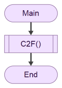

# Lab 1 - Descrição de algoritmos com **fluxogramas**

## Aplicação Flowgorithm

Deverá desenvolver os seguintes algoritmos com recurso à aplicação [Flowgorithm](http://www.flowgorithm.org/index.html), cuja instalação e uso foi introduzida no enunciado do **Lab0**.

Recomenda-se que elabore cada algoritmo como uma _função_ independente, através de `Program > AddFunction...` (coloque só o nome do algoritmo, e.g., `C2F` no exercício 1, e ignore os outros detalhes).

Para alternar entre a execução de exercícios diferentes, adicione apenas um bloco `Call` no algoritmo `Main`, invocando o algoritmo respetivo, e.g.:



Sempre que necessitar de mudar de algoritmo para execução, altere a função invocada neste bloco.

:warning: Não se esqueça de guardar o seu trabalho! A aplicação permite guardar o "projeto" através de `File > Save As...` (ficheiro com extensão `.fprg`). Mais tarde, pode voltar a abri-lo na aplicação.

## Exercícios :pen:

> :bulb: No final deste enunciado encontra "Ajudas" para alguns exercícios, mas só as deverá utilizar se não conseguir mesmo encontrar a solução.

1. Crie um algoritmo (`C2F`) que converte temperaturas em graus _celsius_ para graus _fahrenheit_. A temperatura a converter deve ser solicitada ao utilizador.

    - Fórmula de conversão: $F = C * \frac{9}{5} + 32$

    - Execução exemplificativa desejada:

    

---

2. Crie um algoritmo (`Swap`) que solicita ao utilizador dois valores inteiros (um de cada vez, guardando-os em variáveis diferentes, e.g., `x` e `y`) e posteriormente troque o conteúdo das variáveis e as mostre. 

    - :bulb: Poderá necessitar de uma terceira variável para a troca.

    - Execução exemplificativa desejada:

    

---

3. Crie um algoritmo (`Grade`) para calcular a classificação qualitativa de uma nota.

    - Este algoritmo avalia a nota de um aluno e mostra uma classificação com base nos seguintes intervalos de notas:

    Intervalo de notas | Classificação (output)
    ---|---
    $\lt50$ | "Insuficiente"
    $[50, 70[$ | "Suficiente"
    $[70, 90[$ | "Bom"
    $\geq 90$ | "Excelente"

---

4. Crie um algoritmo (`LeapYear`) para determinar se um ano é _bissexto_ (i.e., fevereiro tem 29 dias). O ano a determinar deve ser solicitado ao utilizador.

    A lógica de verificação segue uma regra simples baseada na divisão do ano por 4, 100 e 400. Um ano é bissexto se:

    1. For divisível por 4 **e**
    2. **Não** for divisível por 100, **exceto** se também for divisível por 400.
    
    - :bulb: Ser _divisível_ significa que o resto da divisão é `0` (zero). Utilize o **operador _módulo_** para este efeito.

    > **Descrição da lógica necessária a implementar**
    > - Primeiro, verifica-se se o ano é divisível por 4. Se não for, o ano não é bissexto.
    > - Se for divisível por 4, verifica-se se é divisível por 100. Se não for, o ano é bissexto.
    > - Se for divisível por 100, então precisa também ser divisível por 400 para ser bissexto. Caso contrário, não é.

---

5. Crie um algoritmo que simule o jogo do "Pedra, papel e tesoura". O algoritmo começa por gerar aleatoriamente um valor (ver nota) no conjunto `{0, 1, 2}`, que correspondem a `{"Papel", "Pedra", "Tesoura"}`. Depois coloca numa variável do tipo _String_ a palavra correspondente ao valor aleatório gerado. Posteriormente, solicita ao utilizador para introduzir a sua escolha, devendo este escrever "Papel", "Pedra" ou "Tesoura" (valor lido para outra variável do tipo _String_). Por fim, indica quem ganhou (o programa ou o utilizador) seguindo as regras do jogo: a tesoura ganha ao papel, a pedra ganha à tesoura e o papel ganha à pedra.

    - Nota: utilize uma atribuição, e.g., `x = Random(3)` para gerar um número no intervalo `[0,2]`. `Random` é uma função existente no Flowgorithm.

---

6. Idealize um pequeno problema que gostasse de resolver através de um algoritmo. Proceda à sua implementação.

## Ajudas

Se não conseguir encontrar uma solução, utilize os seguintes algoritmos em _pseudo-código_ para o ajudar.

### `Grade`

```markdown
Entrada: nota
Se (nota >= 90) então:
   Exibir "Excelente"
Senão se (nota >= 70) então:
   Exibir "Bom"
Senão se (nota >= 50) então:
   Exibir "Satisfatório"
Senão:
   Exibir "Insuficiente"
```

### `LeapYear`

```pseudocódigo
Entrada: ano
Se (ano % 4 == 0) então:
   Se (ano % 100 == 0) então:
      Se (ano % 400 == 0) então:
         Exibir "Ano bissexto"
      Senão:
         Exibir "Ano não é bissexto"
   Senão:
      Exibir "Ano bissexto"
Senão:
   Exibir "Ano não é bissexto"
```

---

bruno.silva@estsetubal.ips.pt
